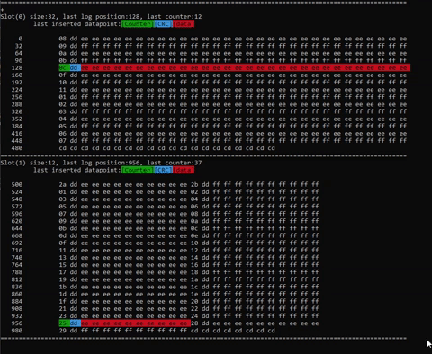

# Endurance_EEPROM
a try implement an endurance way to save log data in eeprom, going to use it for 24LC64
i have no experience with EEPROM but this is how i attmept to make a library that should have wear leveling and safe to write logging into eeprom using circle buffer and variable to track log sequence.


## methodology:
```
[                         EEPROM Available Space is 8KB                                         ]
[               slot 1 x-bytes             ][...][               slot n x-bytes                 ]
[Header + S1_log(1)][...][Header+ S1_log(n)] [...] [Header+ Sn_log(n)][ ... ][Header + Sn_log(x)]
```

the user divide the eeprom into SLOTS which will have the o-ring written into it.

### what is `[slot]`:

its like dividing the eeprom to different areas of log. maybe you will have struct data that is written every 10 minute and another that is written every 2 days. its waste to write them both in the same struct. so we define 2 slots one for slow update rate struct and the other for the fast update rate.
the slot that contains high rate of writes should be larger to increase the indurance of the EEPROM.

remember, this is not variable updating, all the data are logs, and you can access last n structs.
defining slot size depending on:
- how many history data points you want to keep in the slot.
- how much is the size of your data.
- how frequently you are inserting new data to the slot.

every time you write data into your slot. im adding header bytes to your data:
- counter unsigned integer: * to identify the last data inserted in the slot.
- CRC: checksum to prevent fail data and restore last correct written data.

### simulation:
running the code in pc while developing the library.



#### example:
- a 23 byte struct
- the user assign a slot to have full eeprom size (8K)
- \+ 1 byte for crc8
- \+ n byte for counter
with 8K/25 byte data, we can have less than 320 data points in the slot.
so our counting integer should have bandwidth of counting to 321.
- hence we need [9bits] for counter or [2 bytes]
- total data size = 26 bytes, counting = 308


#### eeprom data example:
* what is the header of the data.\
`header: [counting byte][crc8]`

* how the eeprom should look like:\
` [[ 1 ][crc8][struct 23 byte]] [[ 2 ][crc8][struct 23 byte]] ... [[307][crc8][struct 23 byte]] `

* after adding 1 more data:\
` [[308][crc8][struct 23 byte]] [[ 2 ][crc8][struct 23 byte]] ... [[307][crc8][struct 23 byte]] `

* add 1 more data:\
` [[308][crc8][struct 23 byte]] [[ 1 ][crc8][struct 23 byte]] [[ 3 ][crc8][struct 23 byte]] ... `

#### detect last data:
the library writes the counter variable in sequence, once it reaches highest counter. it restart from 1 again. although highest number in the counter is actually bigger than the logs that are written in the slot.

hence:
slot that containts 4 logs:  
` [[1][crc8][log]] [[2][crc8][log]] [[3][crc8][log]] [[4][crc8][log]] `  
after inserting the 5th log. it will be overwritten to the oldest log:  
` [[5][crc8][log]] [[2][crc8][log]] [[3][crc8][log]] [[4][crc8][log]] `  
as you can see above, we have 5 is the max counter (even though we are limited to 4 max logs). this will break the sequence and we can track the latest log.


### EEPROM Interface:
it doesnt matter which chip, im emulating EEPROM in PC, or the flash inside MCU or an EEPROM chip.
however the library should be passed functions to read and write from the Non-volatile memory:

`EELS_Conf.h` constains the function Interface

```c++
/* Include the eeprom functions file here: */
#include "FlashMem.h"
/* DEFINE EEPROM FUNCTIONS HERE: */
#define EELS_EEPROM_READ(addr,buf,length) ROM_Read(addr,buf,length)
#define EELS_EEPROM_WRITE(addr,buf,length) ROM_Write(addr,buf,length)
```


## Links to read:

1- [AVR101: High Endurance EEPROM Storage](http://ww1.microchip.com/downloads/en/AppNotes/doc2526.pdf)\
2- [EEPROM Reliability and Wear Leveling](http://www.mosaic-industries.com/embedded-systems/sbc-single-board-computers/freescale-hcs12-9s12-c-language/instrument-control/eeprom-lifetime-reliability-wear-leveling)\
3- [stack-exchange wear leveling](https://electronics.stackexchange.com/questions/60342/wear-leveling-on-a-microcontrollers-eeprom)\
